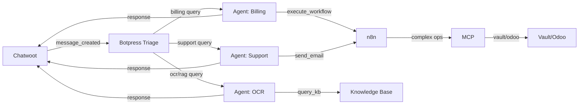

# 🧠 SmarterOS — Operating System Cognitivo para PYMEs Chile

**[Leer Definición de Producto (Visión y Filosofía)](PRODUCT.md)**

SmarterOS es un Sistema Operativo para negocios digitales, diseñado para las PYMEs de Chile.
Integra ERP, CRM, Chat, Automatizaciones, E-commerce, Marketing, KPI y AI Agents en una sola plataforma multi-tenant, con aislamiento por RUT y arquitectura cognitiva en 3 capas.

✔ Auto-hosted en VPS (Hostinger)
✔ Multi-tenant real por RUT
✔ API Gateway + MCP + Vault
✔ Odoo 19 y Shopify listos para venta
✔ n8n + Botpress + Chatwoot + Metabase
✔ Portal Next.js con Clerk SSO
✔ Capacidades nativas de IA en cada módulo

Toda la infraestructura, decisiones y servicios se describen aquí como fuente única de verdad (Single Source of Truth).

📁 **Contenido del repositorio**

- `index.yml` – Entrada principal del OS
- `smos-version.yml` – Versión del sistema
- `decision-tree.yml` – Decisiones arquitectónicas
- `infra/` – Infraestructura, VPS y red
- `services/` – Catálogo de microservicios
- `tenants/` – Plantillas y registro multi-tenant

📚 **Documentación clave**

- [`MULTI-CLOUD-ARCHITECTURE.md`](../docs/MULTI-CLOUD-ARCHITECTURE.md) – Arquitectura multi-cloud (Azure + Google + GitHub)
- [`CHATWOOT-N8N-WEBHOOK-FLOW.md`](../docs/CHATWOOT-N8N-WEBHOOK-FLOW.md) – Integración Chatwoot ↔ n8n webhooks
- [`AZURE-ONBOARDING-FLOW.md`](../docs/AZURE-ONBOARDING-FLOW.md) – Onboarding self-service Azure multi-tenant
- [`n8n-workflow-ocr-classify.md`](../docs/n8n-workflow-ocr-classify.md) – Workflow OCR con clasificación LLM
- [`IDENTITY-AUDIT-SPEC.md`](../docs/IDENTITY-AUDIT-SPEC.md) – Gobernanza de identidad RAG (smarterbotcl@gmail.com)

## 🧠 Arquitectura de 3 Capas Cognitivas

SmarterOS implementa una arquitectura de **3 capas cognitivas** para procesamiento inteligente:

### Layer 1: Execution (n8n)
- **Rol:** Workflow orchestration
- **Latencia:** < 2s
- **Casos de uso:** OCR simple, clasificación básica, integraciones API, scheduled jobs

### Layer 2: Governance (MCP)
- **Rol:** Security, secrets, audit, rate limiting
- **Latencia:** < 500ms
- **Casos de uso:** Vault integration, HMAC validation, audit logs, identity enforcement

### Layer 3: Cognitive (Botpress)
- **Rol:** Multi-turn conversations, RAG, specialized agents
- **Latencia:** 2-5s
- **Casos de uso:** Conversaciones complejas, knowledge base, handoffs automáticos, tool calling

**Flujo típico:** Chatwoot → n8n (clasificación) → Botpress (conversación) → MCP (seguridad) → n8n (ejecución) → Chatwoot (respuesta)

## 🤖 Botpress Agent: Roadmap 2025

SmarterOS evoluciona incorporando **Botpress** como **Layer 3 (Cognitive)** para conversaciones multi-turn, RAG (Retrieval-Augmented Generation) y agentes especializados.

### ¿Por qué Botpress?

- **Multi-tenant architecture:** Workspace isolation per tenant (coherente con Chatwoot, n8n, MCP)
- **RAG per tenant:** Knowledge base con embeddings vectoriales (pgvector)
- **Multi-agent handoffs:** Pattern hub-and-spoke (triage → specialist agents)
- **ADK (Agent Development Kit):** Custom agents con YAML + TypeScript actions
- **CI/CD automation:** botpress/gh-actions para deployment automático
- **Provider agnostic:** OpenAI, Anthropic, Gemini (como n8n y MCP)

### Arquitectura Multi-Agent



### Multi-Tenant Configuration

**Workspace isolation:**
```yaml
tenant_mapping:
	tenant_id: "clerk_user_id"  # from Supabase auth
	workspace_id: "botpress_workspace_<tenant_id>"
  
agents_per_tenant:
	- triage: "workspace_<tenant_id>/bot_triage"     # Router agent
	- billing: "workspace_<tenant_id>/bot_billing"   # Specialist
	- support: "workspace_<tenant_id>/bot_support"   # Specialist
	- ocr: "workspace_<tenant_id>/bot_ocr"           # RAG agent

knowledge_base:
	per_tenant: true
	storage: "pgvector"  # PostgreSQL vector extension
	embedding_model: "text-embedding-3-small"
	chunk_size: 512 tokens
```

### Provisioning

**1. Sandbox (Local Development):**
```bash
cd services/botpress-sandbox
docker-compose up -d  # Botpress + Postgres + Redis
# Access: http://localhost:3010
```

**2. Production (Hostinger/Dokploy):**
```yaml
# services/botpress-agent.yml
deploy:
	platform: "hostinger-dokploy"
	url: "https://botpress.smarterbot.cl"
	container: "botpress/server:latest"
	ports: "3010:3000"
	dependencies:
		- postgres:16  # Shared with Chatwoot/n8n
		- redis:7.2    # Shared
```

### Agent Registration

**ADK YAML specs:**
```bash
# agents/triage.yml
name: "Triage Agent"
role: "Router"
description: "Classifies incoming messages and routes to specialist agents"

handoffs:
	- to: "billing"
		condition: "intent == 'billing' OR keywords.contains('invoice')"
	- to: "support"
		condition: "intent == 'support' OR keywords.contains('help')"
	- to: "ocr"
		condition: "has_attachment AND attachment.type == 'pdf'"
```

**Custom actions (TypeScript):**
```typescript
// actions/execute_workflow.ts
export default async function executeWorkflow(params) {
	const response = await fetch('https://n8n.smarterbot.cl/webhook/botpress-action', {
		method: 'POST',
		headers: {
			'X-SMOS-Identity': 'smarterbotcl@gmail.com',
			'X-SMOS-HMAC': generateHMAC(params)
		},
		body: JSON.stringify(params)
	});
	return response.json();
}
```

### CI/CD con GitHub Actions

```yaml
# .github/workflows/deploy-botpress-agent.yml
name: Deploy Botpress Agent

on:
	push:
		branches: [main]
		paths:
			- 'agents/**'
			- 'actions/**'

jobs:
	deploy:
		runs-on: ubuntu-latest
		steps:
			- uses: actions/checkout@v3
			- uses: botpress/gh-actions@v1
				with:
					api-key: ${{ secrets.BOTPRESS_API_KEY }}
					workspace-id: ${{ secrets.BOTPRESS_WORKSPACE_ID }}
			- run: npm run build-agents
			- run: npm run deploy-agents
```

### Roadmap 2025

#### Q1 2025: Sandbox + Basic Integration ✅ (In Progress)
- [x] Create `services/botpress-agent.yml` specification (782 lines)
- [ ] Deploy sandbox: `docker-compose up -d` (Botpress + Postgres + Redis)
- [ ] Implement triage agent: keywords-based routing (billing/support/ocr)
- [ ] Integrate Chatwoot webhook: `message_created` → POST `/api/v1/chat`
- [ ] Test end-to-end: WhatsApp → Chatwoot → Botpress → n8n → response

**Success criteria:** Latency <5s, accuracy >85%, cost <$0.005/message

#### Q2 2025: RAG Migration
- [ ] Migrate OCR workflow from n8n to Botpress knowledge base
- [ ] Document ingestion: PDF upload → text extraction → chunking → embeddings → pgvector
- [ ] Semantic search: "¿Cuánto debo?" → query KB → retrieve invoice → answer
- [ ] Performance: latency <5s, accuracy >90%, cost <$0.01/query
- [ ] Fallback: if RAG fails → escalate to n8n OCR workflow (legacy)

**Success criteria:** 70% queries solved by RAG, 30% fallback to n8n

#### Q3 2025: Multi-Agent Handoffs
- [ ] Implement hub-and-spoke pattern: triage → specialist agents
- [ ] Handoff logic: Botpress ADK `onHandoff` lifecycle hook
- [ ] Context preservation: Redis cache + Postgres persistence across agents
- [ ] Test complex scenarios: "need invoice copy + technical support" → multi-agent collaboration
- [ ] Monitoring: handoff rate, context loss rate, resolution time

**Success criteria:** Handoff rate >30%, context loss <5%, resolution time <10 min

#### Q4 2025: Enterprise Features
- [ ] Dedicated Botpress per tenant: Azure Container Apps (like n8n)
- [ ] SSO integration: Azure AD authentication for enterprise clients
- [ ] Advanced audit: conversation logs + agent decisions + RAG queries → Redpanda `smarteros.audit.botpress`
- [ ] SLA monitoring: 99.9% uptime, <5s latency, <1% error rate
- [ ] Cost optimization: caching strategies, embedding reuse, LLM fallback tiers

**Success criteria:** 3 enterprise clients migrated, SLA compliance >99.5%

### References

- **Specification:** [`services/botpress-agent.yml`](services/botpress-agent.yml) (782 lines, complete architecture)
- **Botpress ADK:** [github.com/botpress/adk](https://github.com/botpress/adk)
- **Botpress RAG:** [github.com/botpress/rag-migration](https://github.com/botpress/rag-migration)
- **CI/CD:** [github.com/botpress/gh-actions](https://github.com/botpress/gh-actions)
- **Multi-agent patterns:** [Chatwoot AI Agents SDK](https://github.com/chatwoot/ai-agents) (Ruby, inspiración conceptual)
>>>>>>> 7c3024f (refactor: restructure codebase and add product definition)

---

# 🚀 Visión
Construir el primer Operating System cognitivo de LATAM, especializado en empresas con RUT chileno, enfocado en comercio, servicios, ventas por WhatsApp y automatización con IA.

---

# 🏗️ Arquitectura General

                  SmarterOS
           ────────────────────────
            Portal Maestro (Next.js)
           /            |           \
      ERP (Odoo)     CRM (Chatwoot)   Marketing (Blog)
         |              |              |
      Tienda Odoo    Chat IA        Landing
         |              |              |
     Automatizaciones (n8n) — Bot IA (Botpress)
              |             |
              +── KPI (Metabase)

---

# 🧩 Componentes Principales

## 1) Portal Maestro — `app.smarterbot.cl`
Next.js + Clerk SSO  
Dashboard unificado  
Acceso único (SSO)  
Multi-tenant por RUT  
Gestión de tenant, usuarios y dominios  

---

## 2) ERP — `odoo.smarterbot.cl`
Odoo 19.0  
Ventas, inventario, compras, facturación  
Tienda online + POS  
Integración Shopify  
Theme propio vía GitHub Actions  
Addon Clerk integrado  

---

## 3) CRM / Inbox — `crm.smarterbot.cl`
Chatwoot omnicanal  
WhatsApp, Email, Web, Instagram  
Handoff AI ↔ humano  
Workspaces por RUT  
Integración n8n y Botpress  

---

## 4) Automatizaciones — `n8n.smarterbot.store`
Workflows ilimitados  
OCR (Vision API)  
Webhooks Shopify / Odoo  
Clasificación LLM  
Integraciones empresariales  

---

## 5) Bot IA — `botpress.smarterbot.store`
Botpress Cloud + Self-hosted  
AI multi-agent  
RAG por tenant (pgvector)  
Agentes especializados por rol  
Handoff automático → Chatwoot  

---

## 6) KPI — `kpi.smarterbot.cl`
Metabase + PostgreSQL  
Dashboards en tiempo real  
Métricas por tenant  
KPIs de ventas, soporte y conversión  

---

## 7) Marketing — `mkt.smarterbot.cl`
Blog corporativo  
Centro de contenido  
Publicación vía GitHub Actions  
SEO base  

---

# 🔐 IAM y Seguridad

## Clerk (SSO)
Login unificado  
JWT seguro  
Roles por tenant  
Sesiones modernas  

## MCP + Vault
Secrets por tenant  
Audit logs  
Policies por RUT  
Integración segura de agentes  

## Supabase (DB)
Row-Level Security  
Multi-tenant real  
Realtime events  
Tablas normalizadas  

---

# 🌐 Servicios en Producción

| Servicio | Dominio |
|----------|---------|
| Portal | https://app.smarterbot.cl |
| ERP | https://odoo.smarterbot.cl / https://erp.smarterbot.cl |
| CRM | https://crm.smarterbot.cl |
| Chat | https://chatwoot.smarterbot.store |
| Automatizaciones | https://n8n.smarterbot.store |
| Bots IA | https://botpress.smarterbot.store |
| KPI | https://kpi.smarterbot.cl |
| Marketing | https://mkt.smarterbot.store |
| API Gateway | https://api.smarterbot.cl |
| DevOps | https://dokploy.smarterbot.store |

Todos con SSL activo.

---

# 🧠 Arquitectura Cognitiva (3 Capas)

Layer 1 — Inbox (Chatwoot)
Layer 2 — Cognitive AI (Botpress + RAG)
Layer 3 — Execution Engine (n8n)

Latencia total: 2–7s  
Aislamiento por RUT aplicado en toda la plataforma  

---

# 🛠️ Tecnologías

- Odoo 19  
- Next.js 14  
- Clerk SSO  
- FastAPI  
- n8n  
- Chatwoot  
- Botpress  
- Metabase  
- PostgreSQL 16  
- Supabase  
- Caddy + Traefik  
- Docker Compose  
- Hostinger VPS  

---

# 📦 Repositorios

- https://github.com/SmarterCL/smarteros-landing  
- https://github.com/SmarterCL/smarteros-portal  
- https://github.com/SmarterCL/smarteros-crm  
- https://github.com/SmarterCL/smarteros-marketing  
- https://github.com/SmarterCL/odoo-smarter-theme  

---

# 💵 Modelo Comercial

Free — Sandbox  
Starter — $29/mes  
Business — $99/mes  
Enterprise — $299/mes  

---

# 🚀 Roadmap 2026
Pagos Chile (Webpay/Khipu)  
Contabilidad automática  
Booking inteligente  
Shopify App oficial  
Marketplace SmarterBot.store  
Mobile PWA  

---

# 📞 Contacto
Email: smarterbotcl@gmail.com  
WhatsApp: +56 9 7954 0471  
Web: https://smarterbot.cl  

---

# 🟢 SmarterOS — Hecho en Chile para PYMEs de Chile
Automatización, ventas, operaciones y AI en una sola plataforma cognitiva.
