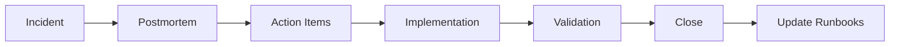

# 📜 SMARTEROS — SERVICE LEVEL AGREEMENTS (SLA)

**Legal binding document - Production environment**

---

## 1. Servicios Cubiertos

Este SLA cubre todos los módulos core de SmarterOS en producción:

| Módulo | URL | Uptime Target | Latency P95 | RPO | RTO |
|--------|-----|---------------|-------------|-----|-----|
| **Portal Maestro** | app.smarterbot.cl | 99.5% | <300ms | 5min | 30min |
| **API Gateway** | api.smarterbot.cl | 99.9% | <200ms | 1min | 10min |
| **ERP (Odoo)** | erp.smarterbot.cl | 99.0% | <800ms | 5min | 25min |
| **CRM (Chatwoot)** | crm.smarterbot.cl | 99.0% | <1200ms | 5min | 15min |
| **Automatizaciones (n8n)** | n8n.smarterbot.store | 99.0% | <2000ms | 10min | 20min |
| **Bot IA (Botpress)** | botpress.smarterbot.store | 99.5% | <1500ms | 10min | 20min |
| **KPI (Metabase)** | kpi.smarterbot.cl | 99.0% | <3000ms | 30min | 60min |
| **Vault (MCP)** | vault internal | 99.99% | <80ms | 0min | 5min |
| **Database (PostgreSQL)** | internal | 99.95% | <100ms | 5min | 35min |

---

## 2. Definiciones

### 2.1. Uptime
**Definición:** Porcentaje de tiempo en que el servicio está disponible y operativo en un mes calendario.

**Cálculo:**
```
Uptime % = ((Total Minutes - Downtime Minutes) / Total Minutes) × 100
```

**Exclusiones de Downtime:**
- Mantenimiento programado (notificado 72h antes)
- Fallas de terceros (AWS, Cloudflare, Hostinger)
- Ataques DDoS de > 10 Gbps
- Fuerza mayor (desastres naturales, guerras, pandemias)

### 2.2. Latency P95
**Definición:** El 95% de las requests deben completarse en el tiempo especificado.

**Medición:**
- Endpoint: `/health` o ruta principal
- Medido desde: Cloudflare edge
- Período: Rolling 24 hours

### 2.3. RPO (Recovery Point Objective)
**Definición:** Máxima pérdida de datos aceptable.

**Implementación:**
- Backups automáticos según frecuencia RPO
- Snapshots de bases de datos
- Logs replicados

### 2.4. RTO (Recovery Time Objective)
**Definición:** Tiempo máximo para restaurar el servicio.

**Implementación:**
- Runbooks documentados
- Failover automático (donde aplique)
- Equipo on-call 24/7

---

## 3. Error Budget

### 3.1. Cálculo

```
Error Budget (minutos/mes) = (1 - Uptime Target) × Total Minutes in Month
```

**Ejemplos:**

| Servicio | Uptime Target | Minutes/Month | Error Budget | Hours/Month |
|----------|---------------|---------------|--------------|-------------|
| API Gateway | 99.9% | 43,200 | 43.2 min | 0.72 h |
| Portal | 99.5% | 43,200 | 216 min | 3.6 h |
| Odoo ERP | 99.0% | 43,200 | 432 min | 7.2 h |
| Vault | 99.99% | 43,200 | 4.32 min | 0.072 h |

### 3.2. Error Budget Policy

**Si Error Budget consumido < 50%:**
- Deploys normales
- Features nuevas permitidas
- Experimentos habilitados

**Si Error Budget consumido > 50%:**
- Freeze de features nuevas
- Solo bugfixes y security patches
- Foco en reliability

**Si Error Budget consumido > 100%:**
- Incident declared
- Postmortem obligatorio
- Root cause analysis
- Action plan con timelines

---

## 4. Ventanas de Mantenimiento

### 4.1. Mantenimiento Programado

**Frecuencia:** Máximo 2 veces/mes  
**Duración:** Máximo 2 horas  
**Horario:** Lunes a Jueves, 02:00-04:00 CLT  
**Notificación:** 72 horas antes vía email + banner en app  

**Excluido de SLA:**
- Si notificado con 72h+ de anticipación
- Si ejecutado en ventana aprobada
- Si duración <= 2 horas

### 4.2. Mantenimiento de Emergencia

**Criterios:**
- Vulnerabilidad crítica (CVE score >= 9.0)
- Data breach activa
- Service completely down

**Notificación:** Inmediata  
**Duración:** Variable (best effort)  
**SLA:** Aplica parcialmente (50% del downtime se cuenta)

---

## 5. Penalidades por Incumplimiento SLA

### 5.1. Créditos de Servicio

Si el uptime mensual cae por debajo del target, el cliente recibe créditos:

| Uptime Alcanzado | Crédito |
|------------------|---------|
| 99.0% - 99.49% | 10% del mes |
| 98.0% - 98.99% | 25% del mes |
| 95.0% - 97.99% | 50% del mes |
| < 95.0% | 100% del mes |

**Ejemplo:**
- Plan: Business ($99/mes)
- Uptime: 98.5%
- Crédito: 25% = $24.75

### 5.2. Proceso de Reclamo

1. Cliente envía email a sla@smarterbot.cl dentro de 30 días
2. Incluir:
   - Fecha/hora del incidente
   - Descripción del problema
   - Evidencia (screenshots, logs)
3. SmarterOS valida en 5 días hábiles
4. Crédito aplicado en siguiente factura

### 5.3. Límites

- Máximo crédito por mes: 100% de la mensualidad
- No acumulable entre meses
- No reembolsable en efectivo
- Solo aplica a planes pagos (no Free tier)

---

## 6. Responsabilidades del Cliente

El SLA NO aplica si el downtime es causado por:

1. **Uso inadecuado:**
   - APIs llamadas fuera de rate limits
   - Datos malformados
   - Integraciones bloqueadas por rate limit

2. **Configuración incorrecta:**
   - Webhooks mal configurados
   - Credenciales incorrectas
   - Dominios mal apuntados

3. **Acciones del cliente:**
   - Cambios no autorizados
   - Eliminación de datos
   - Modificación de settings críticos

4. **Fallas de terceros del cliente:**
   - Shopify down
   - WhatsApp down
   - Pasarelas de pago down

---

## 7. Monitoreo y Transparencia

### 7.1. Status Page

**URL:** https://status.smarterbot.cl

**Actualización:**
- Tiempo real para incidentes activos
- Histórico de 90 días
- Uptime calculado mensualmente

**Subscripción:**
- Email alerts
- Slack webhook
- RSS feed

### 7.2. Reportes Mensuales

Enviados dentro de los primeros 5 días del mes:

```markdown
# SmarterOS - Monthly SLA Report
**Mes:** Noviembre 2025
**Cliente:** Acme Corp (RUT: 76953480-3)

## Resumen
- **Uptime Global:** 99.87%
- **Incidentes:** 2 (SEV3)
- **Downtime Total:** 56 minutos
- **SLA Status:** ✅ Cumplido

## Por Servicio
| Servicio | Target | Alcanzado | Status |
|----------|--------|-----------|--------|
| API Gateway | 99.9% | 99.95% | ✅ |
| Portal | 99.5% | 99.82% | ✅ |
| Odoo | 99.0% | 99.87% | ✅ |
| Chatwoot | 99.0% | 99.91% | ✅ |

## Incidentes
1. **INC-2025-045** - API Latency Spike
   - Fecha: 2025-11-15 14:30-14:45
   - Duración: 15 min
   - Causa: Database connection pool exhaustion
   - Resolución: Increased pool size

2. **INC-2025-051** - Odoo Slow Queries
   - Fecha: 2025-11-23 09:10-09:51
   - Duración: 41 min
   - Causa: Missing database index
   - Resolución: Index added

## Próximos Mantenimientos
- 2025-12-05 02:00-03:30 CLT: PostgreSQL upgrade
```

---

## 8. Mejoras Continuas

### 8.1. Quarterly Business Reviews

**Frecuencia:** Trimestral  
**Participantes:** Cliente + Account Manager + Tech Lead  

**Agenda:**
- Revisión de SLA compliance
- Análisis de incidentes
- Roadmap de mejoras
- Feature requests
- Performance optimization

### 8.2. Proceso de Mejora



---

## 9. Escalación

### 9.1. Niveles de Soporte

| Nivel | Response Time | Disponibilidad |
|-------|---------------|----------------|
| L1 - Support | 4 horas | Business hours |
| L2 - Engineering | 1 hora | 24/5 |
| L3 - Senior Eng | 30 min | 24/7 |
| L4 - CTO | 15 min | SEV1 only |

### 9.2. Canales de Contacto

**Email:** support@smarterbot.cl (L1)  
**WhatsApp:** +56 9 7954 0471 (L2/L3, emergencias)  
**Slack:** #cliente-acme (Enterprise only)  
**Phone:** +56 9 XXXX XXXX (L3, SEV1 only)  

---

## 10. Términos Legales

### 10.1. Vigencia

Este SLA entra en vigencia desde la fecha de firma del contrato y se mantiene activo mientras el servicio esté contratado.

### 10.2. Modificaciones

SmarterOS puede modificar este SLA con:
- 60 días de notificación previa
- Email a todos los clientes afectados
- Publicación en sitio web

Clientes pueden:
- Aceptar nuevos términos
- Cancelar servicio sin penalidad dentro de 30 días

### 10.3. Ley Aplicable

Este SLA se rige por las leyes de Chile.  
Tribunales competentes: Santiago, Chile.

### 10.4. Límite de Responsabilidad

La responsabilidad total de SmarterOS bajo este SLA no excederá el monto pagado por el cliente en los últimos 12 meses.

---

## 11. Aceptación

**Cliente:** _______________________  
**RUT:** _______________________  
**Fecha:** _______________________  
**Firma:** _______________________  

**SmarterOS (Provider):**  
Pedro Zaffuto - CTO  
**Fecha:** 2025-11-23  
**Firma:** _______________________  

---

## Anexo A: Glossary

**Availability:** % de tiempo que el servicio está accesible  
**Downtime:** Período donde el servicio no está disponible  
**Incident:** Evento que causa degradación del servicio  
**Latency:** Tiempo de respuesta de una request  
**Maintenance Window:** Período programado para mantenimiento  
**RPO:** Recovery Point Objective (pérdida de datos máxima)  
**RTO:** Recovery Time Objective (tiempo de recuperación)  
**SEV:** Severity level de un incidente  
**Uptime:** % de tiempo operativo  

---

**Version:** 1.0  
**Last Updated:** 2025-11-23  
**Next Review:** 2026-02-23
