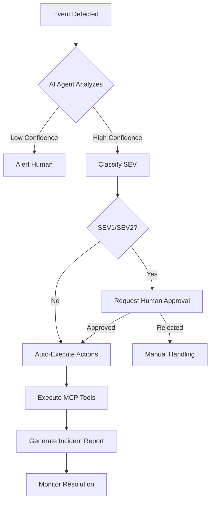

# 🛡️ SMARTEROS — SOC & Playbooks de Seguridad

## 1. Objetivo

Definir el modelo de **Security Operations Center (SOC)** para SmarterOS y los
**playbooks de respuesta a incidentes**, alineados a:

- PYMEs Chile con stack en Hostinger + Dokploy
- Multi-tenant por RUT (Supabase + Vault)
- Integraciones MCP (Shopify, Odoo, n8n, etc.)
- Operación 24/7 apoyada por **AI Security Agent**

Este documento está pensado para:
- Equipo interno Smarter
- Partners técnicos
- Proveedores que operen sobre el stack SmarterOS

---

## 2. Alcance y Activos Críticos

**Plataforma núcleo**

- `app.smarterbot.cl` – Portal / Onboarding / Dashboard
- `api.smarterbot.cl` – API Gateway / Backend
- `vault.mainkey.smarterbot.cl` – Secrets y credenciales
- `dokploy.smarterbot.store` – Orquestación de contenedores
- `Supabase` – Auth, tenencia y datos core
- `n8n.smarterbot.store` – Orquestación de workflows
- `erp.smarterbot.cl` – Odoo (ERP)
- `crm.smarterbot.cl` – Chatwoot (CRM / Soporte)
- `botpress.smarterbot.store` – AI Agents Layer

**Datos sensibles**

- Datos de clientes B2B (RUT, razón social, contactos)
- Tokens de integración (Shopify, Meta, Google, etc.)
- Claves API (OpenAI, proveedores AI, pasarelas de pago)
- Credenciales de infraestructura (Hostinger, GitHub, Vercel)

---

## 3. Clasificación de Incidentes (Severidad)

### **SEV1 — Crítico**
**Ejemplos:**
- Múltiples clientes sin acceso (login caído, API caída)
- Fuga de datos confirmada
- Compromiso de credenciales de producción
- Ransomware / Cryptolocker activo

**SLA Respuesta:** 15 minutos  
**SLA Resolución:** 2 horas  
**Notificación:** Inmediata (WhatsApp + Slack + Email)

### **SEV2 — Alto**
**Ejemplos:**
- Servicio degradado para un subconjunto de clientes
- Acceso no autorizado sospechoso
- Caída de un componente crítico (Odoo, Chatwoot, n8n)
- Vulnerabilidad HIGH explotable detectada

**SLA Respuesta:** 1 hora  
**SLA Resolución:** 8 horas  
**Notificación:** Slack + Email

### **SEV3 — Medio**
**Ejemplos:**
- Errores esporádicos (5xx, timeouts)
- Alertas de seguridad de herramientas (Trivy, CodeQL, Snyk)
- Uso inusual de recursos (CPU, RAM, disco)

**SLA Respuesta:** 4 horas  
**SLA Resolución:** 48 horas  
**Notificación:** Ticket interno

### **SEV4 — Bajo**
**Ejemplos:**
- Hallazgos de hardening pendiente
- Dependencias vulnerables sin explotación activa
- Incidencias en entornos de staging / demo

**SLA Respuesta:** 24 horas  
**SLA Resolución:** 1 semana  
**Notificación:** Backlog

---

## 4. Flujo General de Respuesta a Incidentes

### 1. **Detección**
**Fuentes:**
- Alertas CI/CD (GitHub Actions: `security-scan.yml`)
- Logs de Infra (Dokploy / Hostinger)
- Logs de app (Supabase, API Gateway, Caddy)
- Reportes de clientes / soporte (Chatwoot)
- AI Security Agent (anomaly detection)

**Herramientas:**
```bash
# CLI check
smarter status --all
smarter audit --security
smarter logs api 500 | grep ERROR
```

### 2. **Clasificación**
- Asignar SEV1–SEV4
- Identificar módulos afectados
- Evaluar impacto (nº de tenants, datos sensibles, tiempo)

**Template:**
```markdown
**Incident ID:** INC-2025-XXX
**Severity:** SEV-X
**Detected:** 2025-11-23 14:30 UTC
**Affected:** X tenants, Y users
**Services:** API Gateway, Odoo
```

### 3. **Contención**
**Acciones inmediatas:**
- Revocar tokens / rotar secretos en Vault
- Deshabilitar tenant afectado temporalmente
- Limitar endpoints (rate limiting / firewall app)
- Aislar contenedor comprometido

**Scripts:**
```bash
# Suspend tenant
smarter tenant suspend --rut 76953480-3 --reason "Security incident"

# Rotate secrets
vault write -f /sys/leases/revoke-prefix secret/tenant/76953480-3/

# Block IP
iptables -A INPUT -s 192.168.1.100 -j DROP
```

### 4. **Erradicación**
- Parcheo (dependencias, librerías, contenedores)
- Eliminación de usuarios o tokens comprometidos
- Ajuste de reglas de firewall / WAF

### 5. **Recuperación**
- Restaurar servicio (rollback, nuevo deploy)
- Validar integridad de datos y configuración
- Monitoreo reforzado post-incidente

### 6. **Post-mortem**
- Documento con línea de tiempo
- Causa raíz (root cause)
- Acciones correctivas y preventivas (CAPA)
- Revisión en comité (Tecnología + Negocio)

---

## 5. Playbooks Específicos

### 5.1. PLAYBOOK — Compromiso de Credenciales

**Disparador:**
- Alertas de Gitleaks / TruffleHog
- Commits con secretos filtrados
- Acceso sospechoso desde IP no usual
- AWS/GCP alertas de uso anómalo

**Pasos:**

#### **1. Contención inmediata (0–15 min)**
```bash
# Revocar GitHub PAT
gh auth revoke

# Revocar Vercel tokens
vercel whoami # identify
# Regenerate en dashboard

# Revocar Supabase keys
# Regenerate en Supabase Dashboard > Settings > API

# Pausar deploys
gh workflow disable deploy.yml
```

#### **2. Rotación de secretos (15–60 min)**
```bash
# Vault rotation
vault write -f /sys/leases/revoke-prefix secret/system/

# Update GitHub secrets
gh secret set VERCEL_TOKEN --body "$NEW_TOKEN"
gh secret set SUPABASE_SERVICE_ROLE --body "$NEW_ROLE"

# Update Dokploy env
dokploy env update api CLERK_SECRET_KEY="$NEW_CLERK_KEY"
```

#### **3. Verificación (1–2 h)**
```bash
# Run security scan
gh workflow run security-scan.yml

# Check access logs
cat /var/log/auth.log | grep -i failed
supabase db logs --project "$PROJECT_REF" | grep -i auth

# Audit GitHub
gh api /orgs/SmarterCL/audit-log
```

#### **4. Post-mortem (24 h)**
- Documentar causas (mal uso env, commit directo, etc.)
- Implementar controles (pre-commit hooks, git-secrets, policies)
- Training al equipo

---

### 5.2. PLAYBOOK — Caída de Servicio API / Portal (SEV1)

**Disparador:**
- `api.smarterbot.cl` / `app.smarterbot.cl` retorna 5xx generalizado
- Health checks fallan en monitoreo
- Usuarios reportan "service unavailable"

**Pasos:**

#### **1. Confirmar impacto (0–10 min)**
```bash
# Test endpoints
curl -I https://api.smarterbot.cl/health
curl -I https://app.smarterbot.cl

# Check containers
docker ps | grep -E "smartapi|portal"
docker logs --tail 100 smartapi

# Check DNS/SSL
dig api.smarterbot.cl
openssl s_client -connect api.smarterbot.cl:443 -servername api.smarterbot.cl
```

#### **2. Contención (10–30 min)**
```bash
# If recent deploy → rollback
gh workflow run deploy.yml --ref $(git rev-parse HEAD~1)

# If container crashed → restart
docker restart smartapi
docker restart caddy-proxy

# Check dependencies
docker exec root_postgres_1 pg_isready
vault status
```

#### **3. Diagnóstico rápido**
```bash
# API logs
docker logs --tail 500 smartapi | grep ERROR

# System resources
docker stats --no-stream
df -h
free -m

# Network
netstat -tulpn | grep LISTEN
```

#### **4. Recuperación**
- Aplicar fix mínimo viable (hotfix)
- Deploy a staging primero
- Mantener comunicación a clientes

#### **5. Post-mortem corto (24 h)**
- Documentar causa (bug app, infra, proveedor)
- Crear issue en repo correspondiente
- Actualizar tests / monitoreo

---

### 5.3. PLAYBOOK — Fuga de Datos Sospechosa

**Disparador:**
- Descarga masiva inusual de datos
- Alertas de consultas anómalas en Supabase
- Reporte de cliente sobre acceso no autorizado
- AI Security Agent detecta patrón anómalo

**Pasos:**

#### **1. Contención (0–30 min)**
```bash
# Revoke user tokens
supabase auth users delete "$USER_ID"

# Suspend tenant
smarter tenant suspend --rut "$RUT" --reason "Data breach investigation"

# Enable read-only mode
# Update RLS policies temporarily
```

#### **2. Análisis (30–120 min)**
```sql
-- Supabase audit
SELECT 
  created_at,
  user_id,
  tenant_id,
  operation,
  table_name,
  row_count,
  metadata
FROM audit_logs
WHERE created_at > NOW() - INTERVAL '24 hours'
  AND tenant_id = '76953480-3'
ORDER BY created_at DESC;
```

```bash
# API logs analysis
cat /var/log/api.log | grep "$TENANT_ID" | grep -E "GET|POST" | wc -l

# Correlate IPs
cat /var/log/caddy/*.log | grep "$SUSPICIOUS_IP"
```

#### **3. Notificación (según nivel)**
**Interna:**
- Equipo Smarter + legal
- CTO + CEO (SEV1)

**Cliente afectado:**
- Según acuerdos y legislación aplicable
- Ley 19.628 Chile: notificar dentro de 48h

#### **4. Remediación**
```sql
-- Tighten RLS policies
ALTER POLICY tenant_isolation ON orders
  USING (tenant_id = current_setting('app.tenant_id')::TEXT
    AND user_id = auth.uid());

-- Add rate limiting
CREATE TABLE api_rate_limits (
  ip_address INET PRIMARY KEY,
  request_count INTEGER DEFAULT 0,
  window_start TIMESTAMP DEFAULT NOW()
);
```

#### **5. Cierre**
- Documentar incidente completo
- Actualizar playbook
- Implementar controles adicionales

---

### 5.4. PLAYBOOK — Contenedor Comprometido / Malware

**Disparador:**
- Trivy / Grype alerta vulnerabilidad crítica explotable
- Comportamiento inusual en contenedor (CPU constante, tráfico extraño)
- Proceso desconocido ejecutándose
- Conexiones salientes sospechosas

**Pasos:**

#### **1. Aislamiento (0–15 min)**
```bash
# Stop container immediately
docker stop "$CONTAINER_ID"

# Block network access
iptables -I DOCKER-USER -s $(docker inspect -f '{{range.NetworkSettings.Networks}}{{.IPAddress}}{{end}}' "$CONTAINER_ID") -j DROP

# Take snapshot
docker commit "$CONTAINER_ID" evidence-$(date +%Y%m%d-%H%M)
docker save evidence-$(date +%Y%m%d-%H%M) > /forensics/container-snapshot.tar
```

#### **2. Forense parcial**
```bash
# Extract logs
docker logs "$CONTAINER_ID" > /forensics/container.log

# Check running processes (if still accessible)
docker exec "$CONTAINER_ID" ps aux

# Check network connections
docker exec "$CONTAINER_ID" netstat -tulpn

# File integrity check
docker diff "$CONTAINER_ID"
```

#### **3. Erradicación**
```bash
# Remove compromised container
docker rm -f "$CONTAINER_ID"

# Rebuild from clean source
git checkout main
docker build --no-cache -t smarteros-api:clean .

# Scan new image
trivy image --severity HIGH,CRITICAL smarteros-api:clean
grype smarteros-api:clean
```

#### **4. Validación**
```bash
# Deploy clean image
docker run -d --name smartapi smarteros-api:clean

# Health checks
curl -f http://localhost:8000/health || exit 1

# Monitor 24-48h
watch -n 60 'docker stats --no-stream smartapi'
```

---

## 6. AI Security Agent — Diseño

### 6.1. Objetivo

Tener un **agente de seguridad basado en IA** que:

- Correlacione logs de múltiples fuentes
- Detecte patrones anómalos
- Proponga clasificación SEV y acciones sugeridas
- Genere borradores de post-mortem
- Ejecute acciones automatizadas (con aprobación)

### 6.2. Fuentes de Datos

```yaml
sources:
  ci_cd:
    - github_actions_logs
    - security_scan_results
    - docker_build_logs
  
  infrastructure:
    - dokploy_events
    - hostinger_logs
    - caddy_access_logs
  
  applications:
    - supabase_audit_logs
    - api_gateway_logs
    - odoo_logs
    - chatwoot_logs
    - n8n_execution_logs
  
  security_tools:
    - trivy_scan_results
    - snyk_alerts
    - codeql_findings
```

### 6.3. MCP Tools Disponibles

```typescript
// Agent Security Tools
const securityTools = [
  'security.logs.search',           // Search across all logs
  'security.incidents.create',      // Create incident ticket
  'security.incidents.classify',    // Auto-classify severity
  'vault.rotateSecret',            // Rotate compromised secrets
  'vault.revokeToken',             // Revoke API tokens
  'tenants.suspend',               // Suspend tenant temporarily
  'tenants.enableReadOnly',        // Read-only mode
  'deploy.rollback',               // Rollback to previous version
  'firewall.blockIP',              // Block suspicious IP
  'notify.slack',                  // Alert team
  'notify.whatsapp',               // Alert on-call
  'notify.pagerduty',              // Escalate critical
  'forensics.snapshot',            // Take system snapshot
  'ai.analyze.anomaly'             // Analyze patterns
];
```

### 6.4. Flujo de Operación



### 6.5. Ejemplo de Prompt

```typescript
const securityAgentPrompt = `
You are the SmarterOS Security Agent. Your role is to:

1. Monitor security events across all systems
2. Correlate logs to identify patterns
3. Classify incidents (SEV1-SEV4)
4. Recommend immediate actions
5. Execute approved remediation steps

Context:
- Multi-tenant system isolated by Chilean RUT
- Critical assets: API Gateway, Vault, Supabase, Odoo
- SLA: SEV1 response in 15 min, resolution in 2h

When analyzing an incident:
1. Gather all relevant logs
2. Identify affected tenants
3. Assess data exposure risk
4. Propose containment steps
5. Generate timeline

Available tools: ${securityTools.join(', ')}

Always prioritize data protection and service availability.
`;
```

### 6.6. Implementation

```python
# AI Security Agent (Python + OpenAI + MCP)
from openai import OpenAI
from mcp_client import MCPClient

class SecurityAgent:
    def __init__(self):
        self.client = OpenAI(api_key=os.getenv('OPENAI_API_KEY'))
        self.mcp = MCPClient()
    
    def analyze_event(self, event: dict):
        # Gather context
        logs = self.mcp.call('security.logs.search', {
            'timeframe': '1h',
            'keywords': event['keywords'],
            'tenant_id': event.get('tenant_id')
        })
        
        # AI analysis
        response = self.client.chat.completions.create(
            model="gpt-4-turbo",
            messages=[
                {"role": "system", "content": securityAgentPrompt},
                {"role": "user", "content": f"Analyze this event: {event}\nLogs: {logs}"}
            ],
            tools=[
                {"type": "function", "function": tool}
                for tool in security_tools_schema
            ]
        )
        
        # Execute approved actions
        if response.choices[0].message.tool_calls:
            for tool_call in response.choices[0].message.tool_calls:
                if self.requires_approval(tool_call):
                    self.request_approval(tool_call)
                else:
                    self.mcp.call(tool_call.function.name, tool_call.function.arguments)
        
        return response.choices[0].message.content
```

---

## 7. Métricas SOC

### Key Performance Indicators

| Métrica | Target | Medición |
|---------|--------|----------|
| MTTD (Mean Time To Detect) | < 5 min | Desde evento hasta alerta |
| MTTR (Mean Time To Respond) | < 15 min (SEV1) | Desde alerta hasta primera acción |
| MTTR (Mean Time To Resolve) | < 2h (SEV1) | Desde alerta hasta resolución |
| False Positive Rate | < 10% | Alertas incorrectas / Total alertas |
| Incidents per Month | < 5 (SEV1/SEV2) | Conteo mensual |
| Secret Rotations | >= 4/mes | Rotación proactiva |
| Scan Coverage | 100% | Repos/containers escaneados |

### Dashboard Query (Metabase/Grafana)

```sql
-- Monthly Security Dashboard
SELECT 
  DATE_TRUNC('month', created_at) as month,
  severity,
  COUNT(*) as incident_count,
  AVG(EXTRACT(EPOCH FROM (resolved_at - created_at))/60) as avg_mttr_minutes
FROM security_incidents
WHERE created_at > NOW() - INTERVAL '6 months'
GROUP BY month, severity
ORDER BY month DESC, severity;
```

---

## 8. Checklist On-Call

### Pre-shift
- [ ] Revisar incidentes activos
- [ ] Verificar acceso a todos los sistemas
- [ ] Confirmar contactos de escalación
- [ ] Laptop + móvil cargados
- [ ] VPN configurada

### Durante turno
- [ ] Monitoring activo (cada 2h)
- [ ] Responder alertas < 15 min
- [ ] Documentar todas las acciones
- [ ] Escalar si supera capacidad
- [ ] Mantener log de actividades

### Post-shift
- [ ] Handoff completo al siguiente turno
- [ ] Documentar incidentes resueltos
- [ ] Actualizar runbooks si necesario
- [ ] Reportar mejoras identificadas

---

## 9. Contactos de Emergencia

| Rol | Nombre | Contacto | Horario |
|-----|--------|----------|---------|
| On-Call Engineer | Rotativo | +56 9 XXXX XXXX | 24/7 |
| Security Lead | Pedro Zaffuto | +56 9 7954 0471 | 24/7 |
| CTO | - | cto@smarterbot.cl | Escalación |
| Hostinger Support | - | support@hostinger.com | 24/7 |
| GitHub Support | - | support@github.com | 24/7 |
| Supabase Support | - | support@supabase.com | 24/7 |

---

## 10. Post-Mortem Template

```markdown
# Security Incident Post-Mortem

**Incident ID:** INC-2025-XXX  
**Date:** YYYY-MM-DD  
**Severity:** SEV-X  
**Duration:** Xh Ym  
**Affected:** X tenants, Y users  

## Executive Summary
[2-3 líneas describiendo el incidente]

## Timeline
- **14:00** - Initial alert triggered
- **14:05** - Incident classified as SEV1
- **14:10** - Containment started
- **14:30** - Root cause identified
- **16:00** - Service fully restored

## Root Cause
[Descripción técnica detallada]

## Impact
- **Users Affected:** X
- **Tenants Affected:** Y
- **Data Exposure:** Yes/No - [detalles]
- **Revenue Impact:** $XXX
- **SLA Breach:** Yes/No

## Resolution
[Qué se hizo para resolver]

## What Went Well
- Fast detection
- Team coordination
- Communication

## What Went Wrong
- Late escalation
- Missing runbook
- Insufficient monitoring

## Action Items
- [ ] **P0** - Fix vulnerability - Owner: X - Due: YYYY-MM-DD
- [ ] **P1** - Add monitoring - Owner: Y - Due: YYYY-MM-DD
- [ ] **P2** - Update runbook - Owner: Z - Due: YYYY-MM-DD

## Lessons Learned
[Qué aprendimos para el futuro]

---

**Reviewed by:** [Names]  
**Date:** YYYY-MM-DD
```

---

**Owner:** Security Team  
**Version:** 1.0  
**Last Updated:** 2025-11-23
